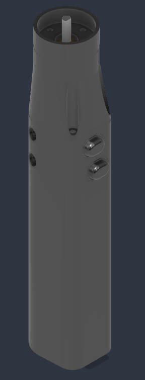
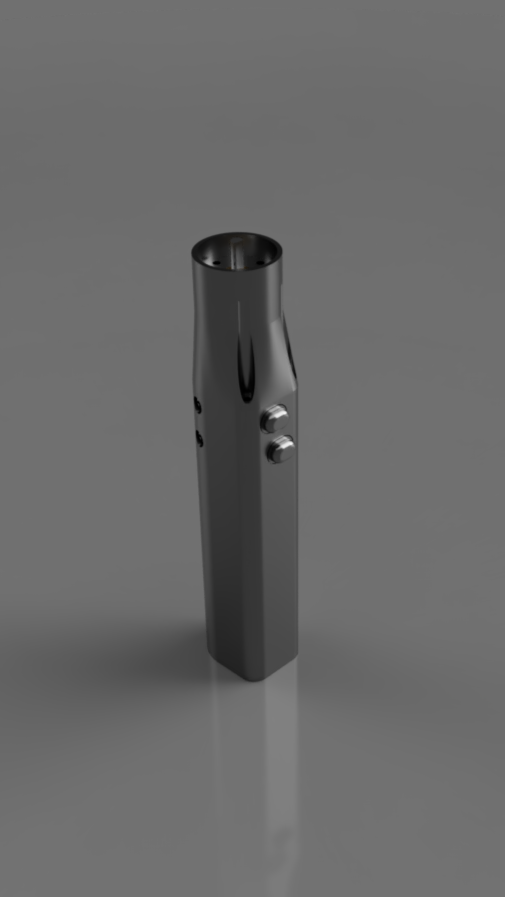
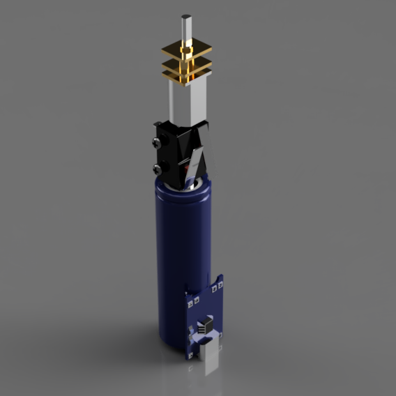
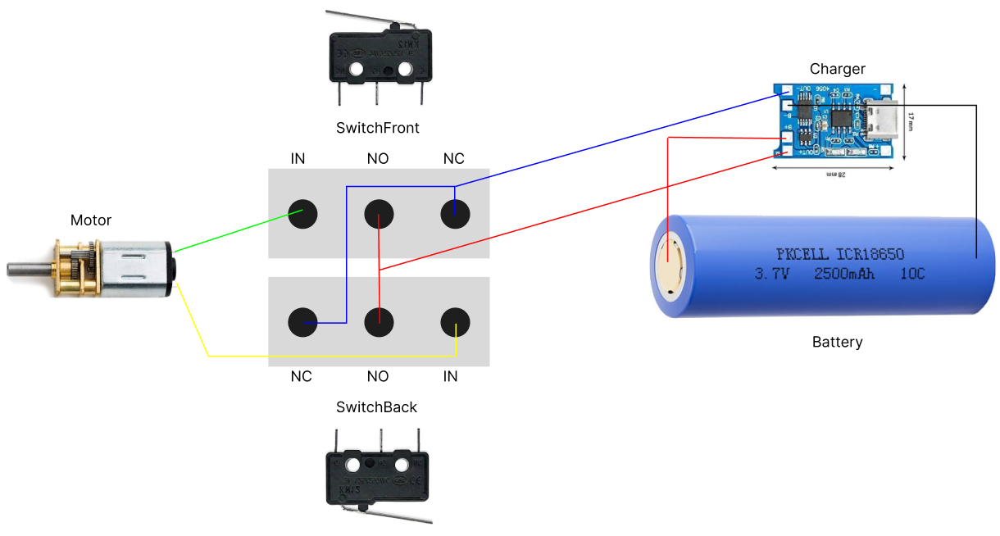

<h1 align="center">e-screwdriver</h1>

  <strong>A 3D-printable, Type-C rechargeable, and 18650 battery-supported compact DIY electric screwdriver.</strong>

---

## 📖 About the Project

**e-screwdriver** is a rechargeable, ergonomic electric screwdriver designed to be easily built at home. The casing is entirely 3D-printable, and it is powered by accessible electronic components including a 6V reductor motor, a TP4056 charging module, and an 18650 Li-ion battery.

All STL/3MF files and the Bill of Materials (BOM) are available in this repository.

## 📷 Images

  
  
  

---

## 🛠️ Bill of Materials (BOM)

To build this project, you will need the following hardware and electronic components:

### Electronics
* **1x** 6V Reductor Motor (200 RPM, 12mm)
* **2x** Micro Switch (For directional control)
* **1x** 18650 Li-ion Battery
* **1x** TP4056 Type-C 1S 3.7V Lithium Battery Charger
* Appropriate length of wiring

### Hardware
* **M2 Screws** (e.g., M2x16mm - For assembling the frame)

---

## 🖨️ 3D Printing and Production

The design files are provided both as individual parts (`.stl`) and as an integrated project file (`.3mf`).

### File Structure:
* `📁 3mf/`
  * `ElectricScrewdriver.3mf` (Slicer project file)
* `📁 Photos/`
  * `Design.png`
  * `InsideOfScrewdriver.PNG`
  * `OutsideOfScrewdriver.png`
* `📁 STL/`
  * `ElectricScrewdriver_Bottom.stl`
  * `ElectricScrewdriver_Button.stl`
  * `ElectricScrewdriver_Main.stl`
  * `ElectricScrewdriver_Tip.stl`
  * `ElectricScrewdriver_Upper.stl`

**Printing Recommendations:**
* **Material:** PETG or ABS (Recommended for heat resistance against the motor and for mechanical strength, though PLA can also be used).
* **Infill:** 20% - 30%
* **Support:** Supports may be required depending on the orientation of the main body and the tip.

---

## ⚙️ Assembly Steps

  

1. **Electronics Prep:** Solder the TP4056 module, 18650 battery, switches, and the motor according to your circuit layout.
2. **Housing Placement:** Fit the soldered components into their respective slots inside the `Main.stl` frame. Ensure the Type-C port aligns with the bottom opening.
3. **Mechanical Assembly:** Connect the upper, lower, and main frames using M2 screws.
4. **Testing:** Press the buttons to verify the forward and reverse rotation of the motor.

---

## 📄 License

This project is licensed under the terms of the `LICENSE` file included in this repository.
